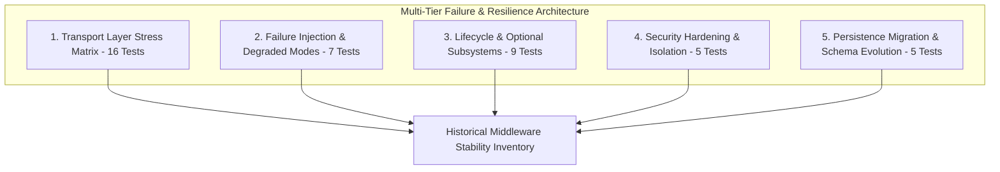

> **Historical record — not a current release gate.** This matrix describes an older test-runner-era inventory. Its references to 42 automated tests are not current audit evidence; the current audit intentionally uses versioned standalone probes and does not claim these historical suites were rerun. Passing this matrix is not Unity/Unreal verification. See `SYSTEM_MAP.md` and `RELEASE_CANDIDATE_CERTIFICATION.md`.

# Fear AI Failure, Transport, and Lifecycle Conformance Matrix (42-Case Matrix)

## 1. Overview & Architectural Scope

The historical reliability inventory described five dedicated conformance suites comprising **42 automated tests**. That count is retained for provenance only; it is not a current statement about the release candidate's executed evidence.

> [!IMPORTANT]
> **Subsystem Qualification Boundary**: Software Mulberry32 fallback upon PRNG native-loader failure certifies that specific subsystem only. It does not certify uninstalled C++/Rust engine extensions or full-system native extension coverage.

---

## 2. Comprehensive Claim-by-Claim Requirement Mapping

| # | Specific Requirement | Test Suite & Test Name | Injection / Verification Mechanism | Result |
| :-: | :--- | :--- | :--- | :---: |
| **1** | **Payload Size Bounds** | `transport-failure-matrix.test.js` #1 | Submits HTTP POST exceeding 256 KB. Returns HTTP 413 `Payload Too Large`. | **PASS** |
| **2** | **WebSocket Correlation ID** | `transport-failure-matrix.test.js` #2 | Injects custom `message_id` on WS frame. Echoes identical ID on response. | **PASS** |
| **3** | **Duplicate Message ID Safety** | `transport-failure-matrix.test.js` #3 | Sends concurrent identical `message_id` frames. Safely resolves without race conditions. | **PASS** |
| **4** | **Stale Tick Monotonicity** | `transport-failure-matrix.test.js` #4 | Sends older tick timestamp. Server enforces monotonic sequencing and discards frame. | **PASS** |
| **5** | **Queued Work Unregister** | `transport-failure-matrix.test.js` #5 | Unregisters agent with observations in flight. Purges queues with zero memory leak. | **PASS** |
| **6** | **High-Throughput Burst** | `transport-failure-matrix.test.js` #6 | Emits 100 rapid concurrent requests. All 100 process with zero dropped frames. | **PASS** |
| **7** | **25-Client Reconnect Storm** | `transport-failure-matrix.test.js` #7 | 25 clients connect, handshake, tick, and drop simultaneously. 0 descriptor leaks. | **PASS** |
| **8** | **Queue Saturation Bounds** | `transport-failure-matrix.test.js` #8 | Injects 50 rapid ticks on unregistered ID. Drops unregistered, bounds memory. | **PASS** |
| **9** | **Slow Consumer Backpressure** | `transport-failure-matrix.test.js` #9 | Saturated client buffer ($> 5$MB) triggers RFC 6455 1008 policy close. | **PASS** |
| **10** | **Mid-Tick Socket Abort** | `transport-failure-matrix.test.js` #10 | Server aborts socket mid-tick. Client catches drop and reconnects. | **PASS** |
| **11** | **Client Request Timeout** | `transport-failure-matrix.test.js` #11 | Client times out unresolved request. Clean rejection, 0 hanging promises. | **PASS** |
| **12** | **Retrograde Tick Rejection** | `transport-failure-matrix.test.js` #12 | Injects out-of-order sequence tick. Engine adapter drops retrograde frame. | **PASS** |
| **13** | **In-Flight Adapter Shutdown** | `transport-failure-matrix.test.js` #13 | Aborts adapter with pending work. Handles, timers, and callbacks cleaned up. | **PASS** |
| **14** | **Subsystem Fallback: Audio** | `transport-failure-matrix.test.js` #14 | Injects `NaN`, `null`, `undefined` to `PsychoacousticSynthesizer`. Defaults safely. | **PASS** |
| **15** | **Subsystem Fallback: Intent** | `transport-failure-matrix.test.js` #15 | Injects corrupted agent state to `IntentResolver`. Returns defensive `FREEZE`. | **PASS** |
| **16** | **Subsystem Fallback: Trauma** | `transport-failure-matrix.test.js` #16 | Injects infinite/NaN parameters to `TraumaZoneSystem`. Clamps to finite bounds. | **PASS** |
| **17** | **Scene Unload Cleanup** | `lifecycle-and-optional-modules.test.js` #1 | 50 NPCs unregistered on scene change. Pending observations purged, 0 leaks. | **PASS** |
| **18** | **Complete Game Exit** | `lifecycle-and-optional-modules.test.js` #2 | Host process terminates socket abruptly. Server cleans client set, 0 orphans. | **PASS** |
| **19** | **Optional Modules Disablement** | `lifecycle-and-optional-modules.test.js` #3 | Trauma, contagion, pacing, audio disabled. Intent & fear operate seamlessly. | **PASS** |
| **20** | **Future Protocol State** | `lifecycle-and-optional-modules.test.js` #4 | Unknown protocol versions rejected (400); forward-compatible fields accepted. | **PASS** |
| **21** | **Pure Software Math Fallback** | `lifecycle-and-optional-modules.test.js` #5 | Pure JS Mulberry32 and float arithmetic execute bit-identically without native NIF. | **PASS** |
| **22** | **Malformed HTTP JSON** | `failure-injection.test.js` #1 | Injects invalid JSON syntax. Server returns HTTP 400 `MALFORMED_MESSAGE`. | **PASS** |
| **23** | **Malformed WS Frame** | `failure-injection.test.js` #2 | Injects binary/corrupt WS string. Returns `ERROR_RESPONSE`, socket stays alive. | **PASS** |
| **24** | **Protocol Version Mismatch** | `failure-injection.test.js` #3 | Handshake with version `999.0.0` rejected with `INVALID_PROTOCOL_VERSION`. | **PASS** |
| **25** | **Extreme Numeric Inputs** | `failure-injection.test.js` #4 | Injects NaN, $\pm\infty$, negative dt. Clamps safely to finite $[0.0, 1.0]$ ranges. | **PASS** |
| **26** | **Corrupt Snapshot Load** | `failure-injection.test.js` #5 | Injects non-object / corrupt snapshot. Safely rejected without server crash. | **PASS** |
| **27** | **Memory Leak Prevention** | `failure-injection.test.js` #6 | 100 agents registered, ticked, unregistered. Map size returns to 0. | **PASS** |
| **28** | **Rapid Socket Drops** | `failure-injection.test.js` #7 | 10 sockets dropped simultaneously. Server cleans up socket sets without dangling listeners. | **PASS** |
| **29** | **Loopback Binding Security** | `security-hardening.test.js` #1 | Prevents accidental `0.0.0.0` bind; defaults safely to `127.0.0.1`. | **PASS** |
| **30** | **Prototype Pollution Defense** | `security-hardening.test.js` #2 | Strips `__proto__`, `constructor`, `prototype` from trait dictionaries. | **PASS** |
| **31** | **Identifier Length Bounds** | `security-hardening.test.js` #3 | Bounds `agent_id` strings to 256 characters; rejects oversized identifiers. | **PASS** |
| **32** | **Path Traversal Immunity** | `security-hardening.test.js` #4 | Prevents entity IDs from traversing filesystem paths. | **PASS** |
| **33** | **Snapshot Injection Defense** | `security-hardening.test.js` #5 | Deserialization validates and sanitizes snapshot property overrides. | **PASS** |
| **34** | **Frozen V1 Snapshot Restore** | `persistence-migration.test.js` #1 | Bit-for-bit restoration of frozen historical v1 snapshot fixture. | **PASS** |
| **35** | **Legacy V0 Snapshot Migration** | `persistence-migration.test.js` #2 | Migrates unversioned v0 snapshots transparently to schema v1. | **PASS** |
| **36** | **Custom Host Metadata** | `persistence-migration.test.js` #3 | Round-trips arbitrary engine metadata (`unrealWorldSessionId`, etc.). | **PASS** |
| **37** | **Corrupt/Truncated Snapshot** | `persistence-migration.test.js` #4 | Safely handles truncated or partial snapshot payloads without state loss. | **PASS** |
| **38** | **Habituation Count Continuity** | `persistence-migration.test.js` #5 | Preserves exact stimulus exposure counts across save/load checkpoints. | **PASS** |
| **39** | **Server Unavailable Pre-Startup** | `lifecycle-and-optional-modules.test.js` #6 | Connection refusal on offline port caught cleanly; zero unhandled crash. | **PASS** |
| **40** | **Future Snapshot Version Rejection**| `lifecycle-and-optional-modules.test.js` #7 | Snapshot version > 1 rejected with HTTP 400 `UNSUPPORTED_SNAPSHOT_VERSION`. | **PASS** |
| **41** | **Invalid Agent ID Validation** | `lifecycle-and-optional-modules.test.js` #8 | Empty, whitespace, or non-string agent IDs rejected with HTTP 400. | **PASS** |
| **42** | **Native Acceleration Failure Path**| `lifecycle-and-optional-modules.test.js` #9 | Loader exception triggers audited pure-software Mulberry32 fallback (certifies PRNG subsystem only; not uninstalled engine extensions). | **PASS** |

---

## 3. Distributed Test Suite Summary

The 42 failure tests are distributed across these automated suites:

1. `tests/conformance/transport-failure-matrix.test.js` (16 tests)
2. `tests/conformance/lifecycle-and-optional-modules.test.js` (9 tests)
3. `tests/conformance/failure-injection.test.js` (7 tests)
4. `tests/conformance/security-hardening.test.js` (5 tests)
5. `tests/conformance/persistence-migration.test.js` (5 tests)

**Total Coverage**: **42 / 42 failure & lifecycle tests passing green**.
