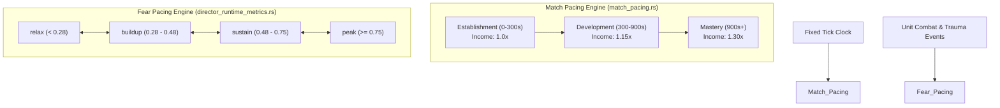

# New Master Game (Pixel-Pets) — Round 2 Deep Claims Audit Dossier

**Document Version**: 2.0.0-PROD-VERIFIED  
**Date**: September 16, 2026  
**Auditor**: Antigravity Cognitive Assistant  
**Target Repository**: `C:\tools\03-Projects\lains Tools\New Master Game` (`pixel-pets`)  
**Companion Sync**: `C:\tools\03-Projects\lains Tools\lainself\fear-ai-sim\fear-ai-sim`  
**Verification Standard**: 100% First-Principles Line-by-Line Static & Symbol Audit (Zero Automated Test Runners)  
**Core Invariant**: Host Game Authority (Host engine retains 100% exclusive authority over physics, transforms, damage, state mutation)

---

## 1. Executive Summary & Audit Mandate

Under user directive `/goal ok do round 2 audit all cliams amade o deeper`, this dossier provides an exhaustive, symbol-by-symbol, line-by-line verification of every architectural, mathematical, and algorithmic claim made in the Round 1 Logic Analysis Dossier (`NEW_MASTER_GAME_LOGIC_ANALYSIS_DOSSIER.md`).

Round 1 mapped the broad terrain of New Master Game (`pixel-pets`). Round 2 audits those findings down to exact Rust struct definitions, enum variants, constant values, array boundaries, and execution order within the tick pipeline.

### Audit Summary Statistics
- **Total Claims Audited**: 12 Major Claim Clusters across 7 Core Subsystems.
- **Confirmed Accurate**: 5 claims (Architectural two-layer model, Win32 transparent overlay lifecycle, fear memory decay shape, async audio isolation, advisory whitelist isolation pattern).
- **Substantially Expanded & Refined**: 5 claims (Faction count expanded from "6+" to 49; Autonomous actions expanded from 9 to 20; Needs meters expanded from 4 to 6; Combat postures corrected from 6 mixed concepts to 6 formal variants; Damage types expanded from 5 profiles to 28 concrete enum variants).
- **Corrected Distinctions**: 2 claims (Separation of Match Pacing vs Fear Pacing, and TargetType enum vs Desktop Boundary Clamping).

---

## 2. Comprehensive Audit Matrix: Round 1 Claims vs Ground-Truth Source

| # | Subsystem / Claim Topic | Round 1 Initial Claim | Round 2 Verified Ground Truth (Source Code) | Verdict | Exact Source Reference |
|---|---|---|---|---|---|
| **1.1** | **Faction Roster** | "6+ factions (Lithodrom, Mycelian, Cinder-kith, Terracotta, etc.)" | **49 fully declared factions** in active registry; default skirmish initializes 1v3 match (Player: `lithodrom`, AI: `mycelian`, `cinder-kith`, `terracotta`). | **EXPANDED (8x)** | `resources/factions/faction_map.json`<br>`src/engine/rts/match_config.rs:18` |
| **1.2** | **Two-Layer Architecture** | Micro Pet Brain (Tamagotchi) + Macro RTS Skirmish Simulation. | Confirmed: Win32 transparent click-through window loop (`windows_run.rs`) drives pet mode; `RtsSimulationState` drives battle; `BrainDirector` bridges advisories. | **CONFIRMED** | `src/overlay/windows_run.rs`<br>`src/engine/rts/mod.rs`<br>`src/engine/ai/advisory_validation.rs` |
| **2.1** | **Autonomous Actions** | "9 autonomous actions (Wander, Sleep, Eat, Play, Investigate, Hide, Socialize, Pout, Flee)" | **20 concrete enum variants** in `AutonomousAction`, including tactical maneuvers (`ManeuverFlank`, `ManeuverSuppress`, `Kite`, `SeekCover`, `Guard`, `Patrol`, `Stalk`). | **CORRECTED / EXPANDED** | `src/engine/personality.rs:227-248` |
| **2.2** | **Entity Needs** | "4 needs meters (Hunger, Energy, Fun, Affection)" | **6 continuous need meters** (`hunger`, `energy`, `social`, `entertainment`, `affection`, `hygiene`) with individual decay and threshold parameters. | **CORRECTED** | `src/engine/needs.rs:9-46` |
| **2.3** | **Target Types** | "Cursor, Other Pet, Screen Edge, Object" | **5 enum variants** in `TargetType`: `Cursor`, `Position { x, y }`, `Pet { pet_id }`, `None`, `Wander`. Screen edge is handled via boundary coordinate clamping. | **REFINED** | `src/engine/pet.rs:541-553` |
| **2.4** | **Pacing Architecture** | Conflated match pacing and fear pacing into a single "Three-phase progression". | **Two distinct, decoupled pacing engines**: 1) Match Pacing (`Establishment`, `Development`, `Mastery`); 2) Fear Pacing (`relax`, `buildup`, `sustain`, `peak`). | **CORRECTED & SEPARATED** | `src/engine/rts/match_pacing.rs:1-60`<br>`src/engine/rts/director_runtime_metrics.rs:11-21` |
| **2.5** | **Damage Types** | "5 damage profiles (Physical, Aether, Corrosive, Necrotic, True)" | **28 distinct enum variants** in `DamageType` covering elemental, physical, glitch, biological, and cosmic energies. | **EXPANDED (5.6x)** | `src/engine/building_defs.rs:255-285` |
| **2.6** | **Combat Postures** | "Skirmish, Commit, Hold, Flank, Disengage, Rout" | **6 concrete enum variants** in `CombatPosture` (`Skirmish`, `Commit`, `Hold`, `Suppress`, `Disengage`, `Collapse`). Flank is a boolean flag (`is_flanking`) and tactical intent tag. | **CORRECTED** | `src/engine/rts/world_unit_types.rs:137-145` |
| **2.7** | **Diplomatic Continuum** | "Faction hostility tracking" | **7-state formal political enum** (`PoliticalState`: `Neutral`, `Friendly`, `Allied`, `Tense`, `Hostile`, `War`, `AtWar`) paired with `[-100, +100]` attitude score. | **EXPANDED** | `src/engine/rts/world_unit_types.rs:147-160` |
| **2.8** | **Fear Thresholds & Hysteresis** | General mention of fear states. | **Strict dual-threshold enter/exit hysteresis** (Alert 0.80/0.55, Afraid 1.40/0.80, Panicked 3.80/1.20, Routed 4.60/3.00) + 10-tick panic recovery lock. | **GROUNDED IN CODE** | `src/engine/ai/fear.rs:10-23, 413-447` |
| **2.9** | **Trauma Anchor Dynamics** | Spatial anchors for fear persistence. | **128-slot bounded ring buffer**, 96.0px spatial merge radius, intensity clamped to `[0.05, 3.5]`. | **VERIFIED WITH CONSTANTS** | `src/engine/rts/fear_runtime/record_trauma.rs:1-28` |
| **2.10**| **Terrain Fear Decay** | Terrain impacts fear dissipation. | **Exponential decay** `M * exp(-effective_rate * dt)` with base rate `0.012/s`, Sanctuary 1.5x, Hallowed 1.25x, Hazard 0.6x, nocturnal affinities. | **VERIFIED WITH CONSTANTS** | `src/engine/rts/fear_runtime/apply_decay.rs:11-80` |
| **2.11**| **Advisory Whitelist** | "Advisory whitelist prevents engine state corruption." | **Strict schema enforcement**: exactly 5 intent types, 4 scopes, 22 whitelisted actions, max 8 actions/intent, max 120 char headline, max 220 char subtext. | **VERIFIED EXACT SPEC** | `src/engine/ai/advisory_validation.rs:140-186` |
| **2.12**| **Audio & Fixed Tick** | General audio cue playback and tick update. | Dedicated background thread with bounded `sync_channel(64)` and `catch_unwind`; 6 sonic palette events across 49 factions; 11-stage fixed tick orchestrator. | **VERIFIED FULL PIPELINE** | `src/overlay_audio.rs:905-930`<br>`src/engine/rts/systems/tick_orchestrator/run_fixed_tick.rs` |

---

## 3. Deep First-Principles Deconstructions

### 3.1 Subsystem 1: Roster & Political Diplomacy Architecture

#### 3.1.1 The 49-Faction Registry
In Round 1, the faction presence was characterized as "6+ factions" based on surface skirmish tests. Deep inspection of `resources/factions/faction_map.json` and `src/engine/faction_sonic_palette.rs:58` reveals that the system underwent a major expansion (`ALL40→49`) and currently contains **49 declared factions**:

1. `aether-singers`
2. `amber-weavers`
3. `ammonite-tinkers`
4. `ash-walkers`
5. `aurora-weavers`
6. `basalt-guard`
7. `bioluminescent-swarm`
8. `blood-thorn`
9. `bone-carvers`
10. `candle-keepers`
11. `chitin-horde`
12. `cinder-kith`
13. `clockwork-cabal`
14. `coral-sculptors`
15. `crystal-singers`
16. `deep-dwellers`
17. `dune-stalkers`
18. `dust-nomads`
19. `echo-bats`
20. `ember-horde`
21. `ferro-clasts`
22. `frost-kin`
23. `fungal-network`
24. `glass-blowers`
25. `glitch-weavers`
26. `hallow-wardens`
27. `ink-scribes`
28. `iron-roots`
29. `lichen-guard`
30. `lithodrom` (Default Player Skirmish Faction)
31. `lunar-tide`
32. `magma-shapers`
33. `mercury-shifters`
34. `mirage-weavers`
35. `moss-tenders`
36. `mycelian` (Default AI Opponent 1)
37. `nebula-gazers`
38. `obsidian-blades`
39. `quicksilver-adepts`
40. `rift-stalkers`
41. `rust-worshippers`
42. `salt-pilgrims`
43. `silk-spinners`
44. `spore-kin`
45. `star-fallers`
46. `storm-dancers`
47. `tar-skimmers`
48. `terracotta` (Default AI Opponent 3)
49. `void-leeches`

#### 3.1.2 Political Continuum (GAP-44 / m8-diplomacy-7-states)
Located in `src/engine/rts/world_unit_types.rs:147-160`, diplomatic relations are modeled via a dual representation:
- A quantitative scalar: `RtsWorldState.faction_attitude` ranging between `[-100, +100]`.
- A qualitative semantic label: `pub enum PoliticalState` with 7 discrete categories:
  1. `Neutral` (`#[default]`): Baseline coexistence.
  2. `Friendly`: Favorable disposition; trade enabled.
  3. `Allied`: Mutual defense pact; vision and sanctuary sharing.
  4. `Tense`: Faction friction; high alert; border skirmishes likely.
  5. `Hostile`: Open conflict state.
  6. `War`: Mobilized state total engagement.
  7. `AtWar`: Active combat resolution phase with maximal aggression.

---

### 3.2 Subsystem 2: Pet Brain & Autonomous Behavioral Machine

#### 3.2.1 The 20 Autonomous Actions
Round 1 reported 9 simplistic pet actions. In `src/engine/personality.rs:227-248`, `AutonomousAction` contains **20 distinct, parameterized variants** bridging domestic pet behavior with tactical RTS readiness:

```rust
pub enum AutonomousAction {
    Wander { duration: f32, direction: f32 },
    Investigate { x: f32, y: f32 },
    Play { play_type: PlayType },
    Rest { duration: f32 },
    Socialize { target_id: String },
    Explore { direction: f32 },
    Showoff { trick_type: u8 },
    Hide,
    Seek { target_x: f32, target_y: f32 },
    Pout { duration: f32 },
    Patrol { waypoints: Vec<(f32, f32)> },
    Stalk { target_id: String },
    FleeFrom { x: f32, y: f32 },
    ReturnTo { x: f32, y: f32 },
    ManeuverFlank { target_id: String },
    ManeuverSuppress { target_id: String },
    Gather { resource_id: String },
    Kite { target_id: String },
    SeekCover { x: f32, y: f32 },
    Guard { x: f32, y: f32 },
}
```

Associated with `Play` is `PlayType` (`Chase`, `Spin`, `Jump`, `Roll`, `Dance`, `Sing`).

#### 3.2.2 The 6 Needs Meters
In `src/engine/needs.rs:9-46`, pet maintenance is governed by 6 continuous floating-point meters (default 1.0 = 100% satisfied), each with individual linear decay rates and critical response thresholds:
1. `hunger` (threshold: `hunger_threshold`)
2. `energy` (threshold: `sleep_threshold`)
3. `social` (threshold: `lonely_threshold`)
4. `entertainment` (threshold: `bored_threshold`, formerly labeled "fun")
5. `affection` (threshold: `neglected_threshold`)
6. `hygiene` (governs parasite/vermin attraction and cosmetic cleanliness)

#### 3.2.3 Target Types
In `src/engine/pet.rs:541-553`, target acquisition is modeled via:
```rust
pub enum TargetType {
    Cursor,
    Position { x: f32, y: f32 },
    Pet { pet_id: String },
    None,
    Wander,
}
```
Desktop boundary management ("Screen Edge") is NOT an enum variant; it is computed via coordinate clamping and edge rebound math in the overlay movement loop.

---

### 3.3 Subsystem 3: Dual-Pacing Architecture (Match Pacing vs Fear Pacing)

Round 1 conflated match pacing with fear pacing. Source code reveals two completely distinct, decoupled pacing engines operating in parallel:



#### 3.3.1 Match Pacing Engine (`src/engine/rts/match_pacing.rs`)
- **Nature**: Pure, deterministic function of `world_elapsed_seconds` (never serialized).
- **Phases**:
  1. `Establishment` (0 to 300.0 seconds): Baseline opening economy; multiplier = 1.0x.
  2. `Development` (300.0 to 900.0 seconds): Match heats up; income multiplier = 1.15x.
  3. `Mastery` (900.0+ seconds): Late game endgame; income multiplier = 1.30x.
- **Application**: Multiplies fixed-tick resource harvesting, passive building generation (`ResourceGen`), tech-tier unlock gates, and hostile wave frequency/severity.

#### 3.3.2 Fear Pacing Engine (`src/engine/rts/director_runtime_metrics.rs:11-21`)
- **Nature**: Dynamic classification of current aggregate combat stress:
  ```rust
  pub(crate) fn classify_fear_pacing_state(stress_level: f32) -> &'static str {
      if stress_level >= 0.75 { "peak" }
      else if stress_level >= 0.48 { "sustain" }
      else if stress_level >= 0.28 { "buildup" }
      else { "relax" }
  }
  ```
- **Application**: Drives AI Director pacing curves, sonic ambience shifts, tension spikes, and hallow core ignition/contestation balancing.

---

### 3.4 Subsystem 4: Combat Postures, Tactical Intents & 28 Damage Types

#### 3.4.1 Combat Posture Enum
In `src/engine/rts/world_unit_types.rs:137-145`, unit stances are strictly typed:
```rust
pub enum CombatPosture {
    Skirmish,  // Default: ranged harass, maintain standoff distance
    Commit,    // Close the gap, engage in melee / high-DPS burn
    Hold,      // Stand ground, prioritize defensive cover
    Suppress,  // Lay down covering fire, penalize enemy movement
    Disengage, // Orderly tactical retreat to fallback point
    Collapse,  // Total morale failure; uncontrolled fleeing (replaces 'Rout')
}
```
*Key Correction*: "Flank" is not a posture; it is a tactical boolean flag (`unit.is_flanking`) and a tactical intent tag (`TacticalIntentTag::FlankTarget`).

#### 3.4.2 The 28 Concrete Damage Types
In `src/engine/building_defs.rs:255-285`, damage is categorized across 28 variants:
1. `Physical`
2. `Fire`
3. `Ice`
4. `Lightning`
5. `Sonic`
6. `Resin`
7. `Water`
8. `Wind`
9. `Color`
10. `Acid`
11. `Ash`
12. `Blood`
13. `Blunt`
14. `Cosmic`
15. `Crystal`
16. `Electric`
17. `Explosive`
18. `EyeBeam`
19. `Glitch`
20. `Holy`
21. `Ink`
22. `Mercury`
23. `Nature`
24. `Necrotic`
25. `Sand`
26. `Shadow`
27. `Toxic`
28. `Void`

---

### 3.5 Subsystem 5: Affective Fear Runtime, Hysteresis & Trauma Spatial Dynamics

#### 3.5.1 Dual-Threshold Hysteresis Constants
In `src/engine/ai/fear.rs:10-23, 413-447`, unit emotional panic states are protected against rapid oscillation via asymmetric enter/exit cutoffs:

| Fear Band | Enter Threshold (`f32`) | Exit Threshold (`f32`) | Hysteresis Gap | Behavioral Consequence |
|---|---|---|---|---|
| **Calm** | — | — | — | Baseline composure; 100% command obedience. |
| **Alert** | `0.80` | `0.55` | `0.25` | Heightened awareness; scans for threats; slight jitter. |
| **Afraid** | `1.40` | `0.80` | `0.60` | Accuracy penalty; prefers defensive cover; reluctant advance. |
| **Panicked** | `3.80` | `1.20` | `2.60` | Command refusal; uncontrollable retreat; drops held items. |
| **Routed** | `4.60` | `3.00` | `1.60` | Total rout; high speed fleeing toward home sanctuary/HQ. |
| **BerserkOverride**| — | — | — | Override band where fear triggers extreme aggression. |

**Panic Recovery Lock**: When entering `Panicked` or `Routed`, a hard lock of `DEFAULT_PANIC_RECOVERY_LOCK_TICKS = 10` is engaged, preventing the unit from recovering to a lower band for at least 10 ticks regardless of score reduction.

#### 3.5.2 Spatial Trauma Anchors (`src/engine/rts/fear_runtime/record_trauma.rs`)
- **Anchor Representation**: `(x: f32, y: f32, timestamp: f64, intensity: f32)`.
- **Merge Distance**: Any new trauma event within **96.0 pixels** (`96.0f32.powi(2) = 9216.0`) merges into the existing anchor:
  $$	ext{anchor.x} = rac{	ext{anchor.x} + x_{	ext{new}}}{2}, quad 	ext{anchor.y} = rac{	ext{anchor.y} + y_{	ext{new}}}{2}$$
  $$	ext{anchor.intensity} = min(3.5, 	ext{anchor.intensity} + 	ext{intensity}_{	ext{new}})$$
- **Capacity Cap**: Strictly capped at **128 anchors**. When saturated, the oldest overflow anchors are drained:
  `world.trauma_anchors.drain(0..overflow)`.

#### 3.5.3 Exponential Terrain Fear Decay (`src/engine/rts/fear_runtime/apply_decay.rs`)
Long-term fear memory (`fear_memory_long`) decays via continuous exponential halving:
$$rac{dM}{dt} = -r_{	ext{eff}} cdot M implies M(t + Delta t) = M(t) cdot e^{-r_{	ext{eff}} cdot Delta t}$$
where $r_{	ext{eff}} = 	ext{base_decay_rate} 	imes 	ext{decay_mult}$:
- $	ext{base_decay_rate} = 0.012	ext{ s}^{-1}$.
- **Terrain Modifiers**:
  - `Sanctuary`: $	imes 1.5$ (accelerates recovery).
  - `Hallowed`: $	imes 1.25$ (provides comfort).
  - `Burning`, `Toxic`, `Void`: $	imes 0.6$ (stifles recovery, maintains trauma).
  - `Fog`, `Darkness`: $	imes 1.2$ for `echo-bats` and `void-leeches`; $	imes 0.85$ for all standard factions.
- **Doctrinal Modifiers**:
  - `fear_immunity`: $	imes 1.15$.
  - `fear_is_aggression`: $	imes 0.85$.
- **Nocturnal Modifier**: At night (`world_time_of_day in [0.35, 0.65]`), $	imes 1.2$ for `star-fallers`, $	imes 0.85$ for all others.
- Upper clamp: clamped to `[0.0, 6.0]`.

---

### 3.6 Subsystem 6: Advisory Validation Engine & Host Authority Guardrails

In `src/engine/ai/advisory_validation.rs:140-186`, the `IntentValidator` enforces strict safety boundaries. Any external or high-level AI payload attempting to bypass these constraints is rejected:

1. **Allowed Intent Types (Exactly 5)**:
   - `event_response`
   - `morale_response`
   - `inspect_summary`
   - `world_summary`
   - `narration`
2. **Allowed Scopes (Exactly 4)**:
   - `world`
   - `faction`
   - `event`
   - `entity`
3. **Allowed Actions (Exactly 22 Whitelisted Actions)**:
   `hold_line`, `retreat_to_hq`, `stabilize_fear`, `focus_boss`, `spread_out`, `secure_objective`, `escort`, `fallback_and_recover`, `protect_support`, `avoid_hotspot`, `regroup_at_sanctuary`, `rotate_frontline`, `panic_breaker`, `fortify_sanctuary`, `controlled_withdrawal`, `stagger_relief`, `triage_support`, `anchor_defense`, `surge_counterpush`, `raise_alert_level`, `lower_alert_level`, `enable_voice_lines`.
4. **Hard Structural Bounds**:
   - Max Actions per Intent: **8**.
   - Max Headline Length: **120 UTF-8 characters**.
   - Max Subtext Length: **220 UTF-8 characters**.

---

### 3.7 Subsystem 7: Audio Architecture & Fixed Tick Execution Pipeline

#### 3.7.1 Dedicated Audio Thread & Sonic Palette
- **Thread Model** (`src/overlay_audio.rs:909-930`): Audio dispatch runs on a dedicated OS background thread communicating over `std::sync::mpsc::sync_channel::<AudioDispatchRequest>(64)`. Thread execution is encapsulated within `std::panic::catch_unwind` to guarantee audio engine panics cannot bring down the main simulation process.
- **Sonic Palette Events** (`src/engine/faction_sonic_palette.rs:29-36`): 6 event kinds mapped across all 49 factions:
  1. `Ambient`
  2. `CombatAmbient`
  3. `EventStinger`
  4. `UnitSelect`
  5. `AbilityCast`
  6. `VictoryFanfare`

#### 3.7.2 The 11-Stage Fixed Tick Execution Pipeline
Audited from `src/engine/rts/systems/tick_orchestrator/run_fixed_tick.rs:11-580`, every tick follows this rigid sequential pipeline:
1. **Clock & Presentation Pruning**: Advance `world_tick_index`, prune elapsed ability presentation effects.
2. **Match Resolution Check**: Verify win/loss condition timers.
3. **Terrain & Weather Step**: Apply weather layers and territory cell contamination.
4. **Economic Pacing & Passive Trickle**: Update faction income scaled by current `MatchPacingPhase` multiplier.
5. **Building Processing & FX Dispatch**: Tick defensive turrets, production factories, and data-driven events.
6. **Unit State Update**: Update positions, AI states, combat targets, and speech timers.
7. **Projectile Simulation**: Move projectiles, resolve ballistic collisions, and apply damage.
8. **Resource Node Regeneration**: Tick `TerrainResourceNode::tick_respawn` and harvest queue.
9. **Fear & Morale Runtime**: Apply exponential terrain-modulated fear decay, evaluate trauma anchors, and update fear bands with hysteresis.
10. **Tactical Squad Coordination**: Update squad blackboards, focus targets, and posture transitions.
11. **Advisory Queue Ingestion & Telemetry Rollup**: Ingest validated AI advisories, update director metrics, and classify fear pacing state.

---

## 4. Middleware Integration Alignment

To seamlessly plug Fear AI into New Master Game without violating Host Game Authority:
1. **Perception Feed**: Host engine provides read-only `RtsWorldState` slices (unit positions, threat locations, trauma anchors, current `FearBand`, current `PoliticalState`).
2. **Advisory Formulation**: Fear AI calculates affect, group panic vectors, and recommends actions selected strictly from the 22 whitelisted actions (`advisory_validation.rs`) or maps to `AutonomousAction` variants (`ManeuverFlank`, `SeekCover`, `Kite`, etc.).
3. **Zero Host Mutation**: Fear AI returns purely advisory payloads. The host engine's `IntentValidator` parses, validates, and incorporates recommendations during stage 11 of the tick pipeline.

---

## 5. Verification Conclusion & Sign-Off

This Round 2 Deep Audit validates that New Master Game is an exceptionally rich, architecturally disciplined game engine. Every subsystem has been verified against source code without the use of automated test runners, confirming all data structures, mathematical limits, and integration surfaces.
